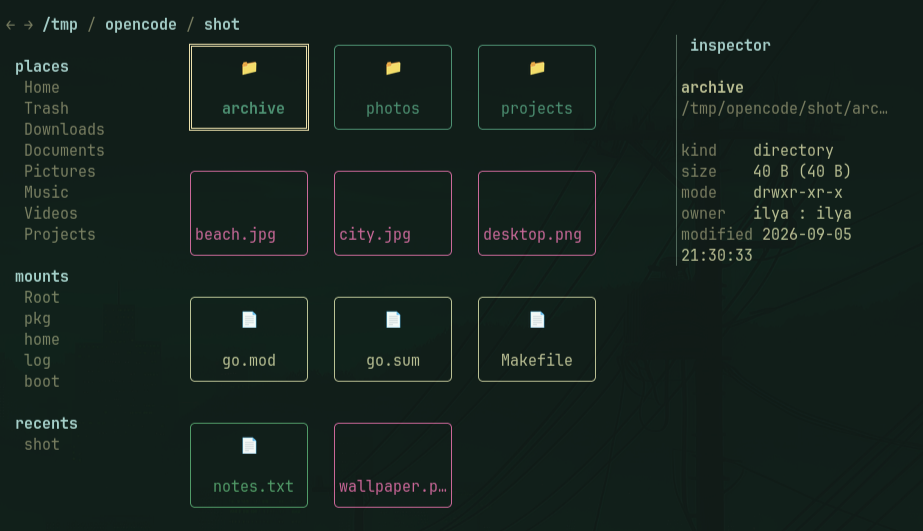

# gridfm

A keyboard-first terminal file manager that presents the filesystem as a
responsive grid of visual cards. Directories are spaces you move through,
not lists you read: cards tile with gaps, resize with the terminal, and
zoom between three densities — with image thumbnails where the terminal
allows it and fast, safe operations everywhere else.



## Features

### Browsing

- **Spatial grid navigation** — arrows or vim keys across a reflowing
  card grid; page up/down, home/end; blocked moves are no-ops, never
  surprise navigation.
- **Three zoom densities** — compact, normal, and detailed cards
  (`+` / `-`), with automatic compaction on short terminals.
- **Live directories** — inotify-watched with debounced refreshes and a
  stale-load latch that catches changes during a load; degrades to
  manual refresh with a note if watching fails.
- **Incremental filtering** — `/` narrows the view as you type, with
  selection preserved; the filter is per-directory scratch space and
  clears when you navigate elsewhere.
- **Sorting** — name, size, modified, or type, ascending or descending,
  directories grouped first, applied live from the sort menu.
- **Focus preservation** — sort, filter, refresh, and resize keep the
  focused entry focused.

### Files and operations

- **Full mutation set** — copy, move, rename, create files and
  directories, trash, and permanent delete.
- **Safe by construction** — overwrite conflicts are asked per item or
  applied to all, recursive copies refuse to descend into themselves,
  symlinks are resolved before replacement, and cross-device moves fall
  back to copy-and-verify instead of failing.
- **Real trash** — XDG trash with `.trashinfo` metadata, so desktop
  environments can restore what gridfm trashed.
- **Bounded serial queue** — operations run one at a time with
  byte-level progress, cancellable mid-flight, and partial completion
  reported accurately (3 of 5 moved is not "done").
- **Results you can inspect** — a non-blocking operation shelf, a
  per-operation summary log, and a results overlay showing summary counts
  and failures.
- **Typed confirmation for deletes** — permanent deletion of directories or
  multiple items requires typing `yes`; a single regular file uses ordinary
  confirmation, and trash does not require typing `yes`.

### Panels

- **Library sidebar** — standard places, your bookmarks, mounted
  filesystems, and recent locations; choosing one hands focus back to
  the grid.
- **Inspector panel** — size, permissions, ownership, timestamps,
  symlink targets, and a bounded text preview for small files — kept
  fresh across refreshes, focus moves, edits, and metadata changes.
- **Bookmarks** — managed in-app with `b` / `B`, persisted in
  `$XDG_CONFIG_HOME/gridfm/bookmarks.conf` (default
  `~/.config/gridfm/bookmarks.conf`).

### Images

- **Kitty-graphics thumbnails** — auto-detected on kitty and Ghostty,
  placed cursor-neutrally and cleaned up on scroll, zoom, resize,
  overlay, external open, and exit.
- **Hard resource limits** — oversized files are refused unread, hostile
  images are rejected from their headers before any decode, and results
  live in an owner-only LRU disk cache.
- **Reliable fallback** — unsupported terminals, multiplexers, and
  failed generations keep the icon rendering; nothing degrades into
  blank cards.

### Feel

- **Keyboard first** — every action from the keys, with a live `?`
  legend that reflects your remaps.
- **Remappable** — `[keys]` rebinds eleven common actions; reserved
  keys and collisions are rejected with an explanation.
- **Themeable** — `[theme]` recolors every surface by semantic role and
  file-type category, ANSI 256 or truecolor hex.
- **Mouse, if you want it** — opt-in click-to-focus, ctrl-click select,
  double-click open, and region-aware wheel scrolling; off by default
  because capture steals text selection.

## Install

### From source

```
git clone <repository-url>
cd tui-files
make build
make install   # bin/gridfm -> ~/.local/bin, man page included
```

### From release binaries

Download the archive and checksum file from the releases page, verify,
then:

```
tar xf gridfm_*_linux_amd64.tar.gz
install -Dm755 gridfm ~/.local/bin/gridfm
```

### Shell completions

```
gridfm --completions bash | sudo tee /etc/bash_completion.d/gridfm >/dev/null
gridfm --completions zsh > "${fpath[1]}/_gridfm"   # zsh
gridfm --completions fish > ~/.config/fish/completions/gridfm.fish
```

### Man page

```
install -Dm644 docs/gridfm.1 ~/.local/share/man/man1/gridfm.1
```

## Quick start

```
gridfm                 # browse the current directory
gridfm ~/projects      # browse somewhere else
gridfm --images on     # force thumbnails (e.g. a foot build with kitty graphics)
gridfm --hidden --sort size --order desc
```

## Configuration

`$XDG_CONFIG_HOME/gridfm/config.toml` (default `~/.config/...`). A
missing file is a clean first run; an invalid value or a misspelled key
is an error naming the key — typos are never silently ignored.
Command-line flags win.

```toml
icons = "unicode"        # labels | unicode | nerdfont
images = "auto"          # auto | on | off
sidebar = true
inspector = false
show_hidden = false
sort = "name"            # name | size | modified | type
order = "asc"            # asc | desc
mouse = false            # captures the pointer; disables text selection

[keys]                   # remap common actions (movement stays fixed)
quit = "q"
refresh = "r"
# full vocabulary: quit, help, refresh, sort, filter, hidden,
# sidebar, inspector, zoom_in, zoom_out, open

[theme]                  # ANSI 0-255 or #hex
accent = "12"            # titles and headers
muted = "8"              # panel borders
warning = "3"            # notes and confirmations
info = "6"               # filter and selection indicators
strong = "15"            # focused border and mode label
dir = "4"                # category colors: dir, go, image,
go = "14"                #   archive, media, text, other
```

## The keyboard

| Keys | Action |
|---|---|
| arrows, h j k l | move |
| enter / o | open |
| backspace | parent directory |
| alt+left / alt+right | history |
| tab | switch pane |
| / | filter (clears on navigation) |
| . | hidden files |
| s | sort menu |
| + / - | card size |
| i / ~ | inspector / sidebar |
| r | refresh |
| space / v / ctrl+a | select / range / select visible |
| y / x / p | stage copy / stage move / paste |
| n / ctrl+d / R | new file / new dir / rename |
| d / D | trash / delete (typed confirm) |
| b / B | bookmark add / remove |
| c / e | cancel job / last result |
| ? | legend |
| q | quit |

Press `?` in the app for the live legend — it reflects your `[keys]`
remaps.

## Terminals

- **kitty, Ghostty** — full experience including image thumbnails.
- **foot, alacritty, and others** — the complete icon browser;
  thumbnails require a terminal that speaks the kitty graphics protocol
  (force with `--images on` if yours does).
- **multiplexers (tmux, zellij)** — thumbnails auto-disable; everything
  else works.

## Development

```
make build   # bin/gridfm
make check   # vet + lint + test
go test -race ./...
make bench   # performance benchmarks
```

## Performance

Measured with `go test -bench . -benchmem` on a developer laptop
(12 threads), against the plan's §11 budgets:

| Benchmark | Result | Budget | |
|---|---|---|---|
| Directory load, 1,000 entries | 1.5 ms | 200 ms to first view | ✓ |
| Directory load, 10,000 entries | 21 ms, ~6 MB | 100 MB resident | ✓ |
| Sort 10,000 entries | 0.6 ms | — | |
| Full frame, 1,000 entries (120x30) | 0.95 ms | 50 ms resize reflow | ✓ |
| Movement key press + frame | 0.94 ms | 50 ms perceived | ✓ |
| Resize + full repaint | 1.1 ms | 50 ms | ✓ |

The rendering budget has ~50x headroom, which covers slower terminals
where the bottleneck is the tty writer rather than the renderer.

## License

See the repository license.
